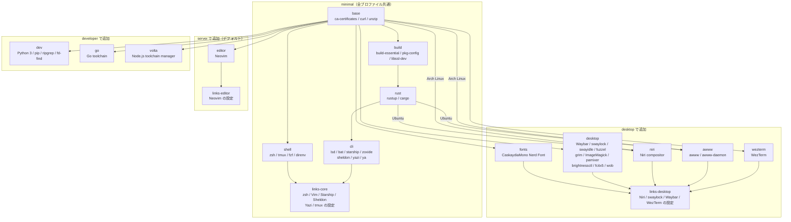

# dotfiles

[](https://github.com/mm-rz/dotfiles/actions/workflows/install-ubuntu.yml?query=branch%3Amain)
[](https://github.com/mm-rz/dotfiles/actions/workflows/install-archlinux.yml?query=branch%3Amain)


新しい環境では、リポジトリを clone した直後に POSIX `sh` のインストーラーを実行する。

```sh
./install.sh --dry-run --profile server
./install.sh --profile server
```

Ubuntu（`apt-get`）と Arch Linux（`pacman`）を自動判定する。判定を上書きして別環境向けの
計画を確認する場合は、`DOTFILES_PACKAGE_MANAGER=apt` または `pacman` を指定できる。

インストール単位には依存関係があり、必要なものは自動的に先に実行される。たとえば
`cli` より先に `rust`、`build`、`base` が導入される。処理済みのコマンドや正しいリンクは可能な限り
スキップされ、既存のリンク先は `.bak`（既にあれば日時付き）へ退避される。

## 依存関係

各subgraphは、そのプロファイルで初めて追加されるツールを表す。`server` は `minimal` を、
`developer` は `server` を、`desktop` は `developer` をそれぞれ含む。実線の矢印は
インストール上の依存関係であり、左側が右側より先に導入される。



## 環境プロファイル

| プロファイル | 直前の段階から追加される主なツール |
| --- | --- |
| `minimal` | zsh、tmux、fzf、direnv、Rust、lsd、bat、Starship、zoxide、Sheldon、Yazi |
| `server` | Neovimとその設定（デフォルト） |
| `developer` | Python 3、pip、ripgrep、fd-find、Go、Volta |
| `desktop` | CaskaydiaMono Nerd Font、Niri、WezTerm、Waybar、swaylock、swayidle、fuzzel、grim、ImageMagick、pamixer、brightnessctl、fcitx5、wob、awww |

環境変数でも選べるため、ホスト固有の起動スクリプトなどから設定できる。

```sh
DOTFILES_PROFILE=desktop DOTFILES_SKIP=fonts ./install.sh
./install.sh --only cli,links-core
./install.sh --list
```

OS パッケージの導入は Ubuntu の `apt-get` と Arch Linux の `pacman` に対応する。
Arch Linux では部分アップグレードを避けるため、最初のパッケージ導入時にリポジトリDBの
同期とシステム全体のアップグレードを行う。
Arch Linux では Niri、awww、WezTerm を公式リポジトリから導入し、Ubuntu では Niri と
awww を公式ソースからビルドして WezTerm の公式 APT リポジトリを利用する。そのため、
Arch Linux の `niri` と `awww` は Rust ビルド環境に依存しない。インストーラー自身が
必要とするものは OS 標準の POSIX `sh` と、このリポジトリの取得に使う `git` だけである。

## CI

`main` ブランチへの push と pull request では、Ubuntu latest と Arch Linux の公式コンテナを
使い、クリーンな環境へ `developer` プロファイルを実際に導入する。主要コマンドと設定の
シンボリックリンクを確認した後、インストーラーを再実行して冪等性も検証する。
累積プロファイルであるため `minimal` と `server` もこの検証に含まれる。より上位の
`desktop` プロファイルは CI の対象外であり、README 冒頭のバッジにも未検証として表示する。
